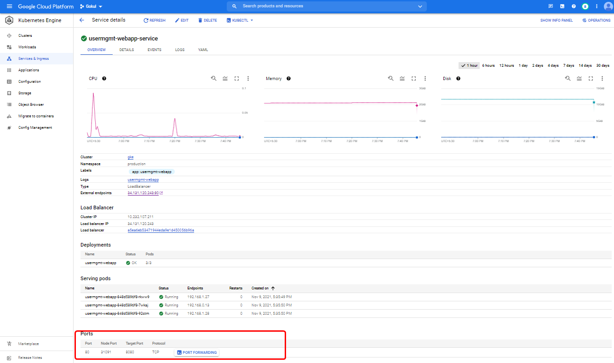
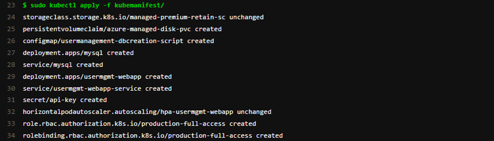

# Overview
```
- Provided entire code in full with kubernetes manifests, pipelines, scripts

- Created a kubernetes Java Application with Mysql DB deployment Manifests to deploy in GKE / AKS cluster using fullyautomated Gitlab DEVSECOPS Pipeline
- Created Storage Class and PVC
- Both Mysql and Usermanagement WebApp deployments need a secret with name API-KEY
- Mounted mysql_usermgmt.sql file as Config-Map(usermanagement-dbcreation-script) in PV
- API-KEY is refered as mysqldbpassword in Mysql environment variables within the container when container starts inside a pod
- API_KEY env variable is not used yet in app, once the Mysql / Usermanagement WebApp pod created it container refer the mysql db password from secret
- Created LoadBalancer Type service for application and included in Code.
- Allocated minimum 2 pods always up and running
- Allocated only 1 pod unavailable during Rolling Update of Deployment
```
# Pre-requisites
```
- Created Gitlab runner VM in GCP
- Installed following tools in Gitlab Runner
  - Trivy
  - Kubectl
  - Azure Cli / gcloud sdk cli
  - Docker
  - Java
  - Maven
  - Terraform
- Created GKE/AKS cluster using terraform script from gitlab runner VM add in same repo (check it from following url https://gitlab.com/gokulakrishnag/gokul/-/tree/terraform for GCP https://gitlab.com/gokulakrishnag/gokul/-/tree/main/GCP)
- Created service account gitlab-runner to login to cluster with its config file which consist of secret and token  (to check gitlabrunner service account YAML from following url https://gitlab.com/gokulakrishnag/gokul/-/blob/main/pre-requisites-serviceaccount-role-rolebinding.yml)
- GitLab Account
- Created Required Kubemanifest files and add in repo
- Created Pipeline using .gitlab-ci.yml
  -stages:
    - dependency
    - build
    - trivyscanner
    - pushtocr
    - deployment
    - zapscanner
```
## Kubemanifest Detail
### Storage Class YAML
```
apiVersion: storage.k8s.io/v1
kind: StorageClass
metadata:
  name: usermgmt-webapp
provisioner: kubernetes.io/gce-pd  #kubernetes.io/azure-disk
reclaimPolicy: Retain  # Default is Delete, recommended is retain
volumeBindingMode: WaitForFirstConsumer # Default is Immediate, recommended is WaitForFirstConsumer
allowVolumeExpansion: true  
parameters:
  type: pd-standard
  fstype: ext4
  # storageaccounttype: Premium_LRS # or we can use Standard_LRS
  # kind: Managed # Default is shared, recommended is Managed


#########################################################################
# If you want to up to date in technology follow me on www.gokulakrishna.me

######################3############################################################
# Additional Reference to remember configuration
# https://kubernetes.io/docs/concepts/storage/storage-classes/#azure-disk

##############################################################################
# Note - 1:
#volumeBindingMode: Immediate - This setting implies that the PersistentVolumecreation, 
#followed with the storage medium (Azure Disk in this case) provisioning is triggered as 
#soon as the PersistentVolumeClaim is created.

# Note - 2:
# volumeBindingMode: WaitForFirstConsumer 
#By default, the Immediate mode indicates that volume binding and dynamic provisioning 
#occurs once the PersistentVolumeClaim is created. For storage backends that are 
#topology-constrained and not globally accessible from all Nodes in the cluster, 
#PersistentVolumes will be bound or provisioned without knowledge of the Pod's scheduling 
#requirements. This may result in unschedulable Pods.
#A cluster administrator can address this issue by specifying the WaitForFirstConsumer 
#mode which will delay the binding and provisioning of a PersistentVolume until a 
#Pod using the PersistentVolumeClaim is created. PersistentVolumes will be selected or 
#provisioned conforming to the topology that is specified by the Pod's scheduling 
#constraints. 
##############################################################################
# Note - 3: 
#reclaimPolicy: Delete - With this setting, as soon as a PersistentVolumeClaim is deleted, 
#it also triggers the removal of the corresponding PersistentVolume along with the 
#Azure Disk. 
#We will be surprised provided if we intended to retain that data as backup.
# reclaimPolicy: retain -  Disk is retained even when PVC is deleted - Recommended Option

# Note - 4:
# Both reclaimPolicy: Delete and volumeBindingMode: Immediate are default settings
##############################################################################
```
### Persistent Volume Claim YAML
```
apiVersion: v1
kind: PersistentVolumeClaim
metadata:
  namespace: production
  name: usermgmt-webapp-pvc
spec:
  accessModes:
  - ReadWriteOnce
  storageClassName: usermgmt-webapp 
  resources:
    requests:
      storage: 5Gi         

# Mapped PVC with customized storage class to retain
# GKE already provisioned Storage classes managed-premium 
```

### MySQL Deployment YAML
```
apiVersion: apps/v1
kind: Deployment
metadata:
  namespace: production
  name: mysql
spec:
  replicas: 1
  strategy:
    type: Recreate
  selector:
    matchLabels:
      app: mysql
  template: 
    metadata: 
      labels: 
        app: mysql
    spec: 
      containers:
        - name: mysql
          image: mysql:5.6
          env:
            - name: MYSQL_ROOT_PASSWORD
              valueFrom: 
                secretKeyRef:
                  name: api-key # mysql-db-password
                  key: db-password
          ports:
            - containerPort: 3306
              name: mysql    
          volumeMounts:
            - name: mysql-persistent-storage
              mountPath: /var/lib/mysql    
            - name: usermanagement-dbcreation-script
              mountPath: /docker-entrypoint-initdb.d # Refer Initializing a fresh instance                                            
      volumes: 
        - name: mysql-persistent-storage
          persistentVolumeClaim:
            claimName: usermgmt-webapp-pvc
        - name: usermanagement-dbcreation-script
          configMap:
            name: usermanagement-dbcreation-script
``` 
## Mysql Service YAML
```
apiVersion: v1
kind: Service
metadata: 
  namespace: production
  name: mysql
spec:
  type: ClusterIP
  selector:
    app: mysql 
  ports: 
    - port: 3306  
# Mysql service mapped with clusterIP    
```
 
### Created Secret for MySQL environment DB Password  YAML (kubernetes Secrets YAML)
```
'dbpassword11' changed to base64 format
 URL: https://www.base64encode.org
---
apiVersion: v1
kind: Secret
metadata:
  namespace: production
  name: api-key # mysql-db-password
type: Opaque # password format changed base64 that's why here we used opaque
data:
  db-password: ZGJwYXNzd29yZDEx

```

## MySQL usermgmnt-dbcreation-script
```
apiVersion: v1
kind: ConfigMap
metadata:
  namespace: production
  name: usermanagement-dbcreation-script
data: 
  mysql_usermgmt.sql: |-
    DROP DATABASE IF EXISTS webappdb;
    CREATE DATABASE webappdb; 
```

## User Management WebApp Deployment YAML
```
apiVersion: apps/v1
kind: Deployment 
metadata:
  namespace: production
  name: usermgmt-webapp
  labels:
    app: usermgmt-webapp
spec:
  replicas: 3
  strategy:
    type: RollingUpdate
    rollingUpdate:
      maxSurge: 1        # how many pods we can add at a time
      maxUnavailable: 1  # maxUnavailable define how many pods can be unavailable # during the rolling update           
  selector:
    matchLabels:
      app: usermgmt-webapp
  template:  
    metadata:
      labels: 
        app: usermgmt-webapp
    spec:
      initContainers:
        - name: init-db
          image: busybox:1.31
          command: ['sh', '-c', 'echo -e "Checking for the availability of MySQL Server deployment"; while ! nc -z mysql 3306; do sleep 1; printf "-"; done; echo -e "  >> MySQL DB Server has started";']      
      containers:
        - name: usermgmt-webapp
          image: flyahead/gokul-usermgmt-webapp:1.2.0
          imagePullPolicy: Always
          ports: 
            - containerPort: 8080           
          env:
            - name: DB_HOSTNAME
              value: "mysql"            
            - name: DB_PORT
              value: "3306"            
            - name: DB_NAME
              value: "webappdb"            
            - name: DB_USERNAME
              value: "root"            
            - name: DB_PASSWORD
              valueFrom: 
                secretKeyRef:
                  name: api-key
                  key: db-password
```
## User Management WebApp Service YAML
```
apiVersion: v1
kind: Service
metadata:
  namespace: production
  name: usermgmt-webapp-service
  labels: 
    app: usermgmt-webapp
spec: 
  type: LoadBalancer #can use NodePort / LoadBalancer / Ingress for external access, here i used LoadBalancer because it recommended method.
  selector: 
    app: usermgmt-webapp
  ports: 
    - port: 80
      targetPort: 8080
```
 

## HPA User Management WebApp YAML
```
apiVersion: autoscaling/v1
kind: HorizontalPodAutoscaler
metadata:
  name: hpa-usermgmt-webapp
spec:
  scaleTargetRef:
    apiVersion: apps/v1
    kind: Deployment
    name: usermgmt-webapp
  minReplicas: 2
  maxReplicas: 10
  targetCPUUtilizationPercentage: 50
# HPA Imperative - Replace
# kubectl autoscale deployment hpa-demo-deployment --cpu-percent=50 --min=1 --max=10
```
## GitLab Pipeline Code '.gitlab-ci.yml'
```
stages:
  - dependency
  - build
  - trivyscanner
  - pushtocr
  - deployment
  - zapscanner
variables:
  GIT_STRATEGY: clone

before_script: # to cross check the permission applied, so added same script (before script) in this stage
  - sudo chmod -R 777 /home/gitlab-runner/builds
  - sudo chown -R gitlab-runner:gitlab-runner /home/gitlab-runner/builds

Dependencies: # to cross check added same before script in this stage
  stage: dependency
  script:
    - sudo chmod -R 777 /home/gitlab-runner/builds
    - sudo chown -R gitlab-runner:gitlab-runner /home/gitlab-runner/builds
  tags:
    - devops
  only:
    - main

Maven Build:
  stage: build
  script: # 1. In this step: It will Build the app and copy the code apache tomcat container and build the image.
    - sudo mvn clean install 
    - sudo chmod -R 777 target
  tags:
    - devops
  only:
    - main

Trivy Scanner:
  stage: trivyscanner
  script:
    - sudo docker images
    - sudo trivy --exit-code 1 --no-progress --ignore-unfixed --severity HIGH,CRITICAL flyahead/gokul-usermgmt-webapp:1.2.0 # if the image has high or critical vulnerability pipeline will be exited.
   # - sudo trivy --no-progress --ignore-unfixed --severity HIGH,CRITICAL flyahead/gokul-usermgmt-webapp:1.2.0 # if you removed the --exit-code it go to next stage.
  tags:
    - devops
  only:
    - main

Image Push to Docker Hub:
  stage: pushtocr
  script:
    - sudo docker push flyahead/gokul-usermgmt-webapp:1.2.0
  tags:
    - devops
  only:
    - main  

AKS/GCP Deployment:
  stage: deployment
  script:
    - sudo kubectl create namespace production
    - sudo kubectl get namespace
    - sudo kubectl apply -f kubemanifest/
    - sudo kubectl get deployments -n production
    - sudo kubectl get pods -n production
    - sudo kubectl get secret -n production
  tags:
    - devops
  only:
    - main

Zap Scanner:
  stage: zapscanner
  script:
    - sudo kubectl get service -n production
    - |
      ServiceIP=`sudo kubectl get svc -n production | grep usermgmt-webapp-service | awk '{print $4}'`
    - sudo docker run -v $(pwd)/report:/zap/wrk/:rw -t owasp/zap2docker-stable zap-baseline.py -I -t http://$ServiceIP -r testreport.html
  tags:
    - devops
  only:
    - main

```
# Implementation Part

## GitLab Pipeline
### Once the Pipeline is triggered:
```
Stage 1 (Dependency): 
 - It will start to run the dependencies stage.
 - This stage will help to execute all other stages in GitLab-runner without any issues.
```

```
Stage 2 (Build): 
 - It will start to run the Java Maven build.
  - Once the war file build is completed.
  - it will start to execute the docker file.
    - it will pull the tomcat image and copy the code into the container.
    - Once code is copied, it will start to build the image.
 ```
 
 
 ```
Stage 3 (Trivy Scanner): Trivy is a container image vulnerability scanner
 - Trivy will start to scan the built image in Stage 2
 - once the scan gets completed it will show the report in the pipeline console screen.
 - if the severity is High and critical it will exit the process and it will not go next stage (I have commented on this step in pipeline code because in my application it shows known/accepted vulnerabilities).
```

```
Stage 4 (Push to Container Registry)
 - It will start to push the image into the Docker hub registry
```

```
Stage 5 (Deployment)
 - It will start to deploy created Kube manifests
	- it will create the namespace production
    - it will create Custom Storage Class and apply to reclaim policy as retain to prevent deletion of PV.
    - Persistent Volume claim and using created storage class.
    - it will Create MySQL Pod with 1 replica and Strategy type Recreate
    - To store and recall non-confidential data from config map file to deployment or other k8s YAML files
       - Create a mysql_usrmgmt.sql file used to drop if already webappdb avail or it will create the DB.
    - To create a Secret file(API-KEY) to keep safe one of the MySQL DB environment configuration mysqldb password.
       - API-KEY environment variable is not used yet in the MySQL pod container, once the container gets created it will fetch the password from the secret file.
    - Created MySQL Cluster IP Service on port 3306
	- Created User Management Application Pod Deployment with 3 replicas and strategy type is RollingUpdate
	   - Add MaxSurge = 1 ( can add 2 pods at a update time) and MaxUnavailable = 1 (only 1 pod unavailable during Rolling Update of Deployment)
	   - Added init container to wait until MySQL service is available.
	   - API-KEY environment variable is not used yet in the user management pod container, once the container gets created it will fetch the password from the secret file.
	- Created user-mgmt-web app LoadBalancer (in code i have mentioned NodeBalancer, here i used LoadBalancer because it recommended method) Service on port 80 and target port is 8080.
	- Created HPA for user-mgmt-webapp with minReplicas = 2 maxReplicas = 10 targetCPUUtilizationPercentage: 50
```



```
Stage 6 (Zap Scanner)

 - It will start DAST scanning with the application URL and provide the report.
```

## Pipeline Success


# Access Application

```
http://<External-IP-from-get-service-output>
Username: admin101
Password: password101
```


